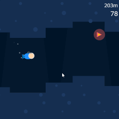

# CharCraftClick: AI-Assisted One-Button Game Development Platform

CharCraftClick is a platform that enables you to easily create, test, and improve high-quality one-button games using interactive AI. It allows anyone to produce innovative and balanced games in a short time, even without technical knowledge.

## Project Overview

This platform aims to enable anyone to create high-quality one-button games, regardless of their game development experience. Its distinctive feature is the ability to interactively execute the entire process from idea generation to automatic evaluation, implementation, and refinement. It resolves the challenges of trial-and-error and subjective evaluation in traditional game development, realizing a data-driven, objective development approach.

## Features

### 1. Data-Driven Game Design and Automatic Evaluation System

- A quantitative indicator-based game design approach that doesn't rely on subjective judgment
- Automatic measurement of metrics like "skill gap," "monotonous input resistance," and "difficulty progression"
- A test environment that simulates player behavior patterns to provide objective evaluation
- Specific guidelines for game improvement based on test results

### 2. Comprehensive Design Guide and Development Framework

- Systematic guidelines covering design challenges specific to one-button games
- Support for all processes from idea creation to implementation, testing, and evaluation
- Classification systems for interaction patterns, environmental interactions, and movement patterns

### 3. Conversational Interface for Efficient Creative Process

- Complete game concept generation, testing, and implementation through dialog
- Simultaneous evaluation and comparison of multiple game ideas to support optimal selection
- Ability to create innovative and balanced games through conversation, even without technical knowledge
- Transparent and traceable process from idea generation to implementation

## Prerequisites

- No special technical knowledge required. Understanding basic game concepts is sufficient.
- Only a browser environment (or Claude application) is needed, with no additional software or tools.
- You need to provide the files in the `knowledge` directory of the repository as project knowledge or attachments.
- Claude 3.7 Sonnet is recommended (enables higher quality evaluation and implementation).
- Turn on Claude's "Analysis tool" feature (essential for game testing in the REPL environment).

## How to Use

### 1. Enter a Theme to Generate Game Ideas

```
Theme: underwater exploration
```

In this step, the system generates multiple unique game concepts based on design guidelines. Each concept features core mechanics, goals, challenge elements, and a scoring system.

> I'd be happy to help you create a one-button game based on the theme of underwater exploration! Let's go through the game development process step by step, following the guidelines in your documents.
>
> ## Idea Generation Phase
>
> Let's start by generating 5 different one-button game concepts based on the underwater exploration theme.
>
> ### Concept 1: "Deep Diver"
>
> 1.  **Core Mechanic**: Button press causes the diver to swim upward; releasing makes them sink due to gravity
> 2.  **Player Goal**: Navigate through narrow underwater caves while collecting treasure
> 3.  **Challenge Elements**: Air bubbles decrease over time; colliding with cave walls damages equipment
> 4.  **Scoring System**: Points for distance traveled plus bonus points for treasures collected
> 5.  **One-Button Pattern**: Press to ascend, release to descend
> 6.  **Unique Appeal**: Balancing vertical movement while managing limited air supply
> 7.  **Risk-Reward Dynamic**: Taking narrow paths has higher risk but offers valuable treasures
>
> ### Concept 2: "Pressure Pulse"
>
> 1.  **Core Mechanic**: Button hold builds up a sonar pulse; release sends it outward in all directions
> 2.  **Player Goal**: Use sonar pulses to detect and reveal hidden sea creatures
>
> ..(snip)..

### 2. Review Automatic Evaluation Results and Select a Game for Implementation

The system evaluates each game concept in the REPL test environment and presents comparison results based on the following metrics:

- Game duration
- Skill gap (score ratio between experts and beginners)
- Difficulty progression
- Resistance to monotonous input patterns (holding, button mashing, etc.)

From the evaluation results, it recommends the most promising game and implements it after approval.

> ## Concept Selection Phase
>
> Based on the test results, "Deep Diver" is the best concept with a rating of "AVERAGE" and a score of 4/12 points. While this may not seem impressive, it outperformed the other concepts significantly. Let's analyze its strengths and weaknesses:
>
> ### Deep Diver - Analysis
>
> **Strengths:**
>
> - Excellent skill gap (4.29x) - Skilled players can perform significantly better
> - Good interaction pattern that requires skill to master
>
> **Weaknesses:**
>
> - Short game duration - Games end too quickly
> - Poor difficulty progression - Game gets too difficult too fast
> - Vulnerable to monotonous input patterns
>
> ### Deep Diver - Improvements Based on Testing
>
> Before implementation, we should improve the concept based on the testing recommendations:
>
> 1.  Lower initial difficulty to extend gameplay duration
> 2.  Make the cave passages wider at the beginning
> 3.  Slow down the air depletion rate
> 4.  Add more scoring opportunities for skilled play
> 5.  Add mechanics that punish monotonous input (add turbulence when holding >button too long)
> 6.  Add power-ups like air tanks to extend gameplay
> 7.  Implement variable obstacle speeds instead of fixed speeds
>
> ## Implementation Phase
>
> Would you like me to implement the improved Deep Diver game using the p5.js template?

```
Implement that
```

### 3. Play the Implemented Game and Refine It Interactively

You can immediately play the game in the browser and provide feedback based on your play experience through conversation. The system converts this feedback into specific improvements and continuously refines the game.

```
Don't let the player move forward
```

> Let me modify the game so the player doesn't automatically move forward. Instead, the cave will scroll past the player who stays in a fixed position horizontally:
>
> I've modified the game so the player no longer moves forward. Instead:
>
> 1.  The player stays at a fixed x-position (horizontally)
> 2.  The cave, treasures, and other elements scroll past the player
> 3.  The player only moves vertically when you press or release the button
> 4.  The scrolling speed is controlled by the `player.scrollSpeed` property
> 5.  Speed power-ups still work but now increase the scrolling speed instead of player movement
>
> This change makes the gameplay more like a classic endless runner or side-scroller where the character remains at a fixed horizontal position while the environment moves around them. The game is still tracking the scrolling distance, and all the other mechanics like treasure collection, air management, and obstacle avoidance work the same way.
>
> The player now only needs to focus on vertical movement to navigate through the cave passages, making the control scheme even simpler and more focused on the "one-button" concept.
>
> Would you like me to make any additional changes to the game?

You can make game balance adjustments, visual changes, mechanics alterations, etc. with simple instructions.

The completed game can be [played in a browser.](https://abagames.github.io/ChatCraftClick/sample-deep-diver.html)

[](https://abagames.github.io/ChatCraftClick/sample-deep-diver.html)

## Tips & Troubleshooting

### Addressing Issues During Game Implementation

- **If the HTML file is too large**: If Claude attempts to create a game that exceeds the Artifact size limit, enter the following:
  ```
  777lines
  ```
  This will optimize the code to fit within the limits. 777lines is the line number limit for HTML files specified in the prompt.

### If You Don't Like the Generated Game Concepts

- **If you want new concepts**: If you're unsatisfied with the test results for the game concepts, you can request new ideas by entering:
  ```
  Other concepts
  ```
  The system will generate new game ideas from different approaches or perspectives.

### For Creating Better Games

- Simple modification instructions are effective (such as "increase jump power" or "increase score multiplier by 1 each time an item is collected")
- Better results are obtained by making and confirming changes one by one rather than requesting multiple small changes at once

## Application Examples

Examples of games you can create using this platform:

1. **bubble-ascent**: You're a fish. Collect bubbles for power-ups! Break rocks

   - Tap to rise

2. **burger-stack**: Drop burger ingredients with good timing. Beware of crosswinds

   - Tap to drop ingredients

3. **orbit-jumper**: Travel across planetary orbits. Orbit moving planets to replenish fuel

   - Tap to jump out of orbit

4. **lava-surfing**: Ride waves of lava and collect minerals
   - Tap to jump to upper lava, hold to move to lower lava

If you want to add BGM or sound effects like in these examples, the following article can be helpful:

- [Creating Mini-Games in the Age of Generative AI - Generating Ideas, Code, Graphics, and Sound](https://dev.to/abagames/creating-mini-games-in-the-age-of-generative-ai-generating-ideas-code-graphics-and-sound-424k)

Specifically, after completing the game, it's good to use the following prompts:

```
Create a prompt for generating appropriate BGM for this game using an AI music generator
```

```
List the necessary sound effects for this game as pairs of names and prompts to give to a sound effect generation AI
```

Generate the BGM as `bgm.mp3` and sound effects as `[name].mp3` and place them in the `audios` folder. The `main.js` of the above game is attached as a reference example. Use the following prompt to add audio file playback logic:

```
Add BGM and sound effect playback code similar to `main.js`. You don't need to implement the GameAudio class as it will be provided externally
```

The [GameAudio class][./docs/utils/game-audio.js] is a utility class for playing audio. Load this file from within the `index.html` file to use it.

## How the Platform Works

### Overall Architecture

This platform consists of the following components:

1. **Interactive AI (Claude)**: Following `prompt.md`, handles user input interpretation, game idea generation, code implementation, and feedback response
2. **Design Guide Data**: Principles and classification systems for one-button game design contained in `game-design-guide.md`
3. **Test Evaluation Engine**: Game evaluation system using `one-button-game-test-framework.js` and `repl-game-testing-prompt.md`
4. **p5.js Implementation Environment**: Game implementation environment based on `p5js-game-template.html`

Information flows as follows:

1. User input (theme) → Idea generation referencing design guide → Multiple game concepts
2. Game concepts → Test evaluation engine → Numerical evaluation results
3. Selected concept → p5.js implementation code generation → Playable game
4. User feedback → Code optimization → Improved game

### Idea Generation Mechanism

The platform's idea generation follows this process:

1. **Theme Analysis**: Extract core elements from user-specified themes
2. **Ensuring Diversity**: Generate different ideas across these dimensions:
   - Button interaction (press, hold, release)
   - Physical principles (gravity, momentum, elasticity)
   - Game environment (spatial constraints and characteristics)
   - Movement patterns (linear, orbital, oscillating)
   - Player goals (collection, avoidance, alignment)
3. **Random Element Integration**: Combine elements such as visual representation, time manipulation, spatial relationships
4. **Design Guide Reference**: Reference each section of `game-design-guide.md` to conform to design principles

Each game concept is defined from seven aspects: core mechanics, player goals, challenge elements, scoring system, one-button pattern, unique appeal, and risk-reward dynamics.

### How the Automatic Evaluation System Works

The evaluation system is implemented in `one-button-game-test-framework.js` and consists of the following elements:

1. **GameSimulator**: Core engine that simulates the game environment

   - Provides physics calculation, collision detection, and object management functions
   - Internally executes game logic equivalent to 60fps

2. **InputPatternGenerator**: Simulates different player types

   - Beginner pattern: slow reactions, irregular timing, frequent mistakes
   - Expert pattern: optimal timing, minimal mistakes, consistent operation
   - Monotonous patterns: simple inputs like button mashing, constant pressing

3. **GameAnalyzer**: Tests games by summing the following evaluation results (maximum 12 points)
   - Game duration (0-3 points)
   - Skill gap (0-3 points)
   - Difficulty progression (0-3 points)
   - Monotonous input resistance (0-3 points)

### Code Generation and Implementation Process

Implementation of the selected game concept is carried out in the following steps:

1. **Template Analysis**: Analyze the structure of `p5js-game-template.html`

   - Input processing system
   - Object pool management
   - Collision detection utilities
   - Core game loop structure

2. **Game Object Definition**:

   - Basic objects such as player, obstacles, collectibles
   - Definition of physical properties and visual representation
   - Implementation of initialization functions and update logic

3. **Core Mechanism Implementation**:

   - Implementation of one-button control mechanism
   - Integration of physics and collision systems
   - Score tracking and display functionality
   - Difficulty progression system

4. **Optimization Process**:
   - Code size optimization (limited to 777 lines)
   - Removal of unnecessary blank lines
   - Simplification of visual effects (as needed)
